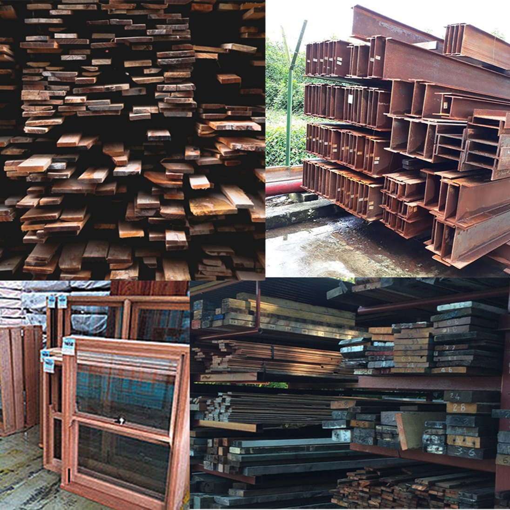

# Circular Design

We build circular and fully self-sufficient homes that makes housing construction affordable and sustainable without compromising on quality.

We use the city as our source. All our materials are carefully harvested and refurbished to new standards by our partner-companies, ready for a second life.

-  Harvesting of buildings is 10% cheaper then demolish them in the traditional way. 

* We use 2nd hand materials to reduce the waste of the traditional construction sector 

* Reduce of CO2 by using 2nd hand shipping containers as our basic structure and 2nd hand materials. (For the production of 1 ton of steel they emit an average of 1.8 tons of CO2.)

* We use circular screw foundation so there will be no use of any concrete. And If you decide to move you will not leave any footprint.